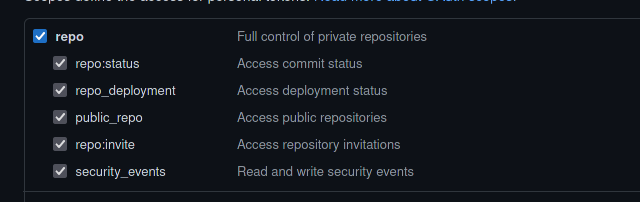
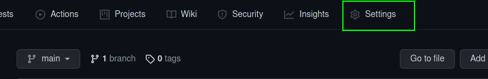
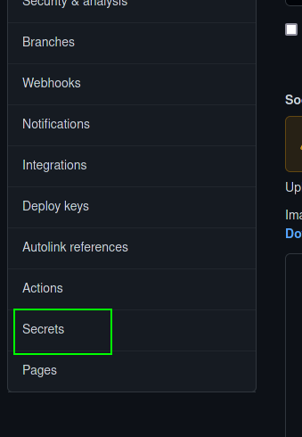
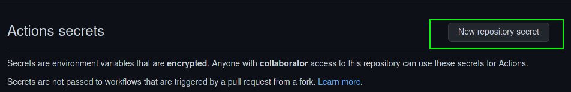
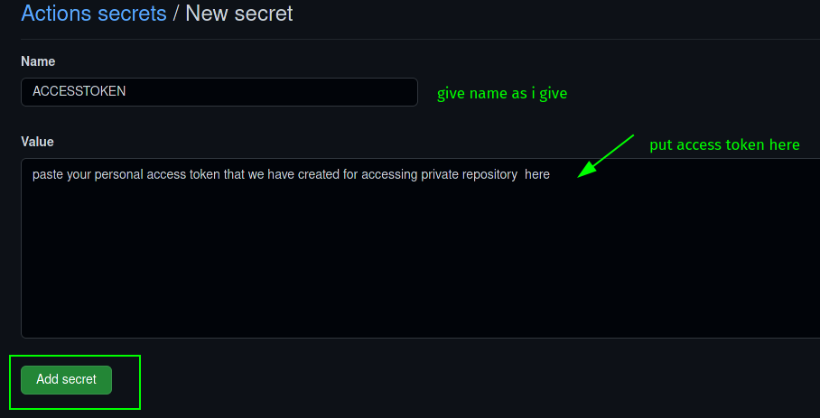
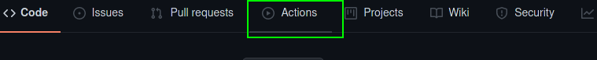
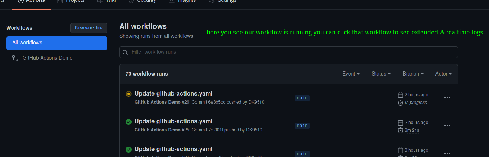
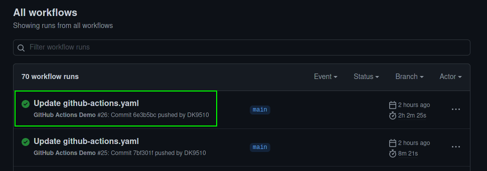
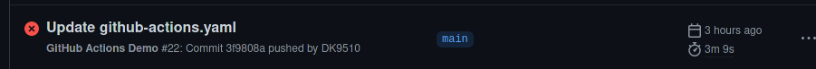

# Automate-With-Actions
## i got idea for this project from project-discovery's pd-actions that is not available 

### what is Github actions
- github actions is one feature of the github that provide us the 2000 minute vm for testing our project in different os
- they provide vm for windows, mac and linux(ubuntu)
- this is vm is run based on the workflow that we have created in the repository
- see here [official documentation](https://docs.github.com/en/actions)
- so based on this i have created a workflow and scripts that process most of recon process for BugBounty Hunting automatic in this cloud vm provided by the github

### how the workflow run
1. installing necessary tools and packages and dependencies 
2. enumeration of subdomains using [amass](https://github.com/OWASP/Amass), [assetfinder](https://github.com/tomnomnom/assetfinder), [subfinder](https://github.com/projectdiscovery/subfinder), crt.sh, subdomain bruteforcing
3. dns resolution: getting CNAME, A,AAAA,PTR records using [massdns](https://github.com/blechschmidt/massdns)
4. finding virtual hosting for domains if there by bruteforce virtual host using [gobuster](https://github.com/OJ/gobuster)
5. checking subdomain or vhost is alive or not by [httpx](https://github.com/projectdiscovery/httpx) which test for all http methods and give result
6. port scanning using [naabu](https://github.com/projectdiscovery/naabu), for fast output we only use nmap's top-1000 port you can specify all port but it will take time
7. fuzz the domains after probing through [httprobe](https://github.com/tomnomnom/httprobe) for the critical directory, you customize the wordlist in the fuzzing directory
8. final we scan the live domains using project discovery's [nuclei](https://github.com/projectdiscovery/nuclei) for scanning cves, vulnerabilities etc, you can change the configuration file nuclei.yaml in configs/
9. For notification purpose i have used [notify](https://github.com/projectdiscovery/notify) but this didn't work in github vm  if you running this script in local machine or in vps then it will work. change config for notify in configs/notify.yaml and also see notify's official documentation for how to config it for your own.

# how to use 
## setup workflow
1. fork this repository and make this private since the output is commited in forked repo & you didn't want to make your work public...
2. In 2nd new created repo make add new file `.github/workflows/github-actions.yaml`
3. create personal Access token for github see [documentation](https://docs.github.com/en/github/authenticating-to-github/keeping-your-account-and-data-secure/creating-a-personal-access-token) be sure to check this other don't need for this project, this will allow read and write actions to private repository

5. copy the personal access token and add secret in 2nd private repo that we have created [documentation](https://docs.github.com/en/actions/reference/encrypted-secrets) 




7. now copy content from `workflow/github-actions.yaml` file and paste in second private repo that we have created i.e `.github/workflows/github-actions.yaml`
8. only change this in workflow but
![assets/work-flow.png]
9. now you workflow file is complete just commit the changes and go to actions page


10. if your workflow runs successfully and exit than you see this

otherwise you see like this


- if your workflow is run successfully we go to next step

## setup notification to get on Discord
- [here you can see how to create discord webhook](https://support.discord.com/hc/en-us/articles/228383668-Intro-to-Webhooks)
- after creating webhook copy webhook url configure your github repo, but take not that you configure automate-with-actions repo no need to add webhook in another repo because the result will commited in this forked repository, where we added workflow file,
-  you see how to configure github repo in above documentation
- if you configure properly just do commit in any file and you see notification in discord channel

### For project discovery's notify
- see documentation [here](https://github.com/projectdiscovery/notify)
- for currently  this doesn't work for github vm, but if you clone repo and run scripts in local vm or in vps then it will work
- config file for notity is `configs/notify.yaml`

# configuring scripts
- if target program have some rate limit then tune the script acc to rate limit
- the scripts that need to tune is
```bash
scripts/fuzzer.sh
configs/nuclei.yaml - nuclei config file
scripts/vhost.sh
scripts/port-scan.sh
scripts/httpx.sh
```

# give domain name
- if all the above setup is complete that we can proceed with next step is give domain 
- take any bounty program
- if it has wild card domain in scope than you put domain name in `domains.txt`

eg:
```bash
if *.google.com , *.youtube.com etc 
```
then put
```
google.com
youtube.com
```
in `domains.txt `
- if any outofscope domains are given then put it in outofscope.txt
eg 

For out of scope then we put it in `outofscope.txt` as
```bash
acc.google.com
ads.youtube.com
```
- dont put all domains in single line in any of the file

- now you are ready to test your workflow

# run workflow
- go to `.github/workflows/automate-with-actions.yaml` file in your 2nd private repository and edit workflow file like comment or uncomment `echo hello DK or or any echo file but don't script file, if you do that script will not run but if you want to not run that script file than you comment it`
- commit the change and it will start your workflow, you can see it in `actions` tab in that repository, 
## NOTE:
`Every time you commit in 2nd repository workflow will run so, take note of this while commit change to workflow file, you only have 2000 min per month `
## NOTE :
`if you put domains of large companies break workflow in like in 1 st phase only do sub-enum, httpx, vhost, dns-resolve & port-scan & in 2nd phase do fuzzing and nuclei scan, because if your workflow run for more than 360 min, then github cancel workflow and you lost your result if it is not commited + you lose 360 min from total 2000 min`

## NOTE:
`the vm instance is created on the basis of workflow file, and this workflow only runs if any push event happened in that repository , where the .github/workflows/your-workflow-file.yaml is present`

## NOTE: 
`In every script i have put example email and name you need to modify that email and name acc to your github accout and name`

## NOTE:
`you can add more scripts and tune it as you wish but dont forget to modify workflow file in .github/workflows/*.yaml file unless it dont reflect if you have add new scripts.`

- you can customize the scripts written by me to your own preference and add feature you want

# tools i have used in this project
- [owasp-amass](https://github.com/OWASP/Amass)
- [project-discovery subfinder](https://github.com/projectdiscovery/subfinder)
- [tomnomnom's assetfinder](https://github.com/tomnomnom/assetfinder)
- [tomnomnom's httprobe](https://github.com/tomnomnom/httprobe)
- [tomnomnom's anew](https://github.com/tomnomnom/anew)
- [gobuster](https://github.com/OJ/gobuster)
- [project discovery's Naabu: port scanner](https://github.com/projectdiscovery/naabu)
- [httpx ](https://github.com/projectdiscovery/httpx)
- [project discovery's notify](https://github.com/projectdiscovery/notify)
- [massdns](https://github.com/blechschmidt/massdns)
- [github actions](https://docs.github.com/en/actions)

## Author : [DK9510](https://github.com/DK9510)
## Twitter: [DishantKapadiya](https://twitter.com/DK_9510)
## Acknowledge : give thankyou to project discovery team for give idea to create similar project like pd-actions, and all the creators of tools who created this fantastic tools
